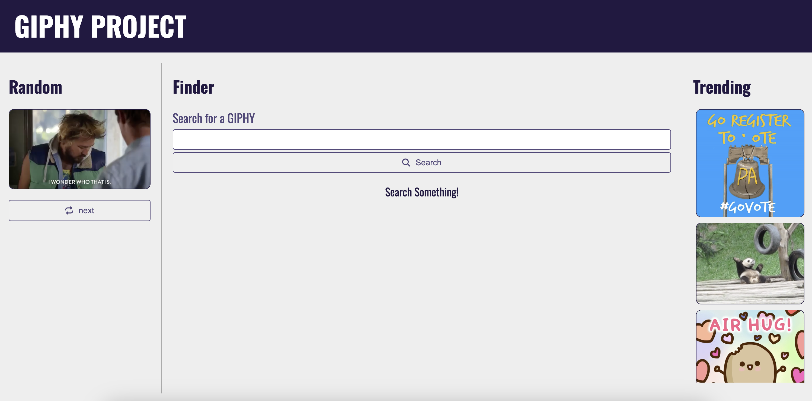

# Project Name

> One paragraph statement about the project.

Additional description about the project and its features.

## Getting Started

**This is an example of how you may give instructions on setting up your project locally.**
**Modify this file to match your project, remove sections that don't apply. For example: delete the testing section if the currect project doesn't require testing.**

To get a local copy up and running follow these simple example steps.

### Prerequisites

### Setup

### Install

### Usage

#TODO

- Clean up magic numbers in scss files (change colors.scss to variables.scss and put magic numbers there with meaningfull values)
